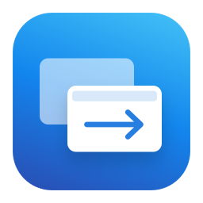
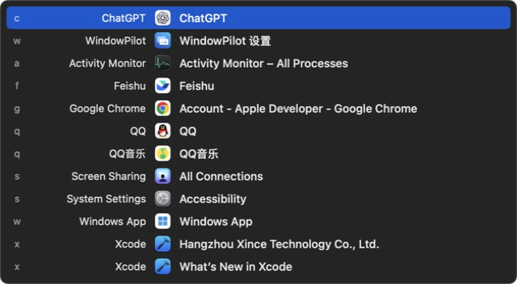
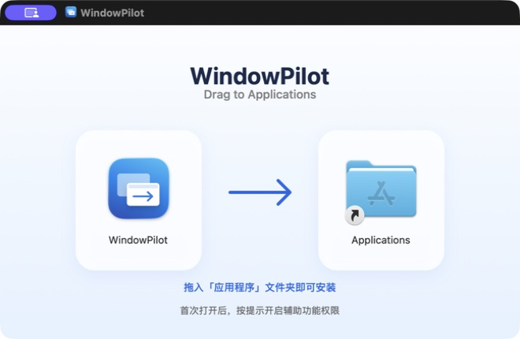
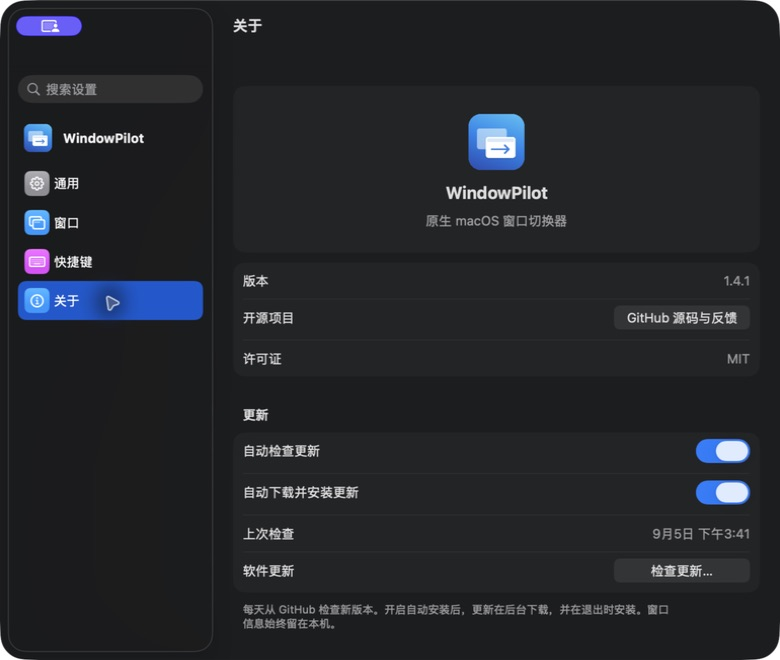
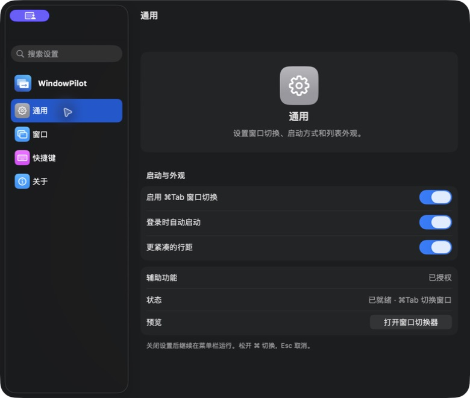

<p align="center"></p>
<h1 align="center">WindowPilot</h1>
<p align="center">按窗口切换，松开即到。</p>
<p align="center">
  <a href="https://github.com/luckyyyyy/WindowPilot/actions/workflows/build.yml"></a>
  
  
  <a href="LICENSE"></a>
</p>

WindowPilot 是一个用 SwiftUI 和 AppKit 编写的原生 macOS 窗口切换器。按住 **⌘ Tab**，直接选择要去的窗口；最小化的窗口也能恢复到前台，独立设置窗口可以单独选择。

灵感来自 [Contexts](https://contexts.co/) 的纵向窗口列表；本项目独立实现，与 Contexts 无关联，也不包含其代码或素材。




## 安装

1. 从 [Releases](https://github.com/luckyyyyy/WindowPilot/releases/latest) 下载 DMG，打开后将 **WindowPilot** 拖到 **Applications**。
2. 从“应用程序”打开，在“系统设置 → 隐私与安全性 → 辅助功能”中允许 WindowPilot。
3. 按 **⌘ Tab** 开始切换。右上角菜单栏的重叠窗口图标可打开设置、暂停切换或退出。

从 1.4 起支持自动更新：默认每天检查 GitHub Releases，在后台下载并于退出时安装。菜单栏的“检查更新…”可立即更新，“设置 → 关于”可关闭自动检查或自动安装。1.3 及更早版本需要手动安装一次新版。更新包和更新列表均验证 EdDSA 签名。已实测从 1.4.0 后台下载、安装并重启到 1.4.1，授权与设置保留，详见 [验证记录](VALIDATION.md)。

正式版本使用 Developer ID 签名，应用已通过 Apple 公证并附带离线公证票据。

需要 **macOS 26 或更新版本**，支持 Apple Silicon 和 Intel。首次运行请退出其他接管 ⌘Tab 的切换器。无需屏幕录制权限。





## 使用

- **窗口标题一目了然**：每个独立窗口单独一行，应用名、图标和真实窗口标题并排显示。
- **默认紧凑**：28 点行高，面板随结果数量自动调整高度；超过所在显示器可用高度的 80% 才滚动。搜索和关闭窗口后也会重新调整，可切换为更宽松的行距。
- **恢复最小化窗口**：列表显示最小化状态，选择后自动恢复；隐藏应用也可切换。
- **管理选中窗口**：非搜索状态下按 ⌘W 关闭窗口、⌘Q 请求退出所属应用，保留原应用的保存与取消流程。
- **按 X 搜索**：先按 `x` 进入搜索，再输入关键词（例如 `xq` 搜索 QQ，前缀 `x` 不计入搜索词）。搜索中即使按住 ⌘，`w` / `q` 也只输入文字；删空关键词仍保持搜索模式，Esc 取消。支持 Unicode 和多个关键词。
- **按需过滤**：选择是否显示最小化、隐藏和无窗口应用；按应用及标题添加排除规则。
- **原生设置**：系统侧边栏、搜索、分组表单与登录启动选项，跟随系统外观。

| 操作 | 快捷键 |
| --- | --- |
| 下一个 / 上一个窗口 | ⌘ Tab / ⌘ ⇧ Tab |
| 当前应用的下一个窗口 | ⌘ `（可关闭） |
| 关闭选中窗口 | ⌘ W |
| 退出选中窗口所属应用 | ⌘ Q |
| 确认 | 松开 ⌘ 或 Return |
| 上下选择 | ↑ / ↓ |
| 搜索 | 先按 X，再输入关键词 |
| 取消 | Esc |




无窗口应用的 ⌘W 不执行操作。关闭或退出遇到保存确认时，会收起列表并显示目标应用。标题排除规则支持正则表达式：`设置` 匹配包含“设置”的标题，`^设置$` 只匹配完整标题；留空表示排除整个应用。

## 构建

安装 Xcode 26+，选择其命令行工具。Swift Package Manager 会下载固定版本的 Sparkle 2.9.6，用于软件更新。

```sh
git clone https://github.com/luckyyyyy/WindowPilot.git
cd WindowPilot
./scripts/test.sh
./scripts/build.sh --universal
open dist/WindowPilot.app
```

省略 `--universal` 只编译本机架构。打包 DMG 还需 Python 3.10+；脚本会在 `.build/` 中创建独立环境并安装固定版本的 dmgbuild：

```sh
./scripts/build-dmg.sh
```

构建脚本优先使用本机 Developer ID，其次 Apple Development 证书；没有证书时使用 ad-hoc 签名。可用 `WINDOWPILOT_SIGN_IDENTITY` 指定身份，设为 `-` 可强制 ad-hoc。自动构建产物是 **未公证的开发版本**，正式分发请使用 Releases。参见[发行流程](docs/RELEASING.md)。

## 实现与隐私

窗口读取、恢复和关闭使用公开 Accessibility API；SwiftUI 提供界面，AppKit 管理浮层和自身窗口，`SMAppService` 管理登录启动。软件更新通过 Sparkle 连接 GitHub Releases；不采集遥测、不上传窗口信息，窗口标题仅在本机处理。

扫描和切换使用独立队列，按键不等待整轮扫描。AX 通知按应用合并增量刷新，定时完整校准；超时应用保留缓存并退避重试。自身窗口始终在主线程通过 AppKit 操作，避免同进程 AX 回调引起崩溃。详见[架构](docs/ARCHITECTURE.md)和[验证范围](VALIDATION.md)。

应用需要公开 Accessibility 窗口信息才能逐窗识别。跨 Space、全屏切换和最小化动画遵循 macOS 行为；安全输入期间系统可能暂停全局快捷键。暂停或退出 WindowPilot 后，系统 ⌘Tab 恢复。

## 参与

欢迎提交 issue 和 pull request。报告窗口兼容问题时请提供 macOS / 应用版本、窗口类型及复现步骤，截图前请隐藏私人标题。开发约定见 [CONTRIBUTING.md](CONTRIBUTING.md)。

[MIT License](LICENSE)
