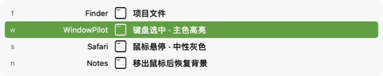
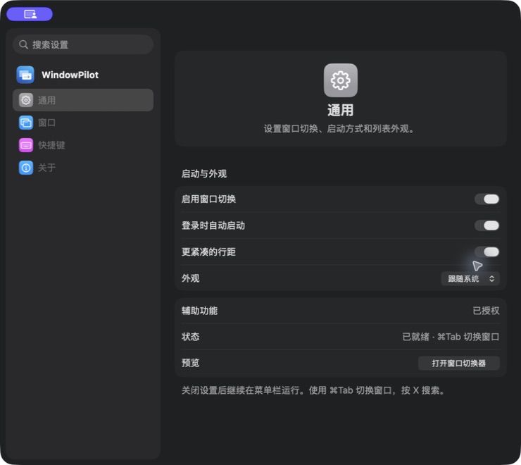
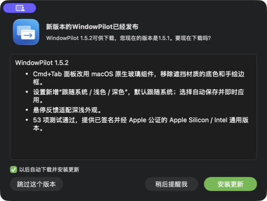
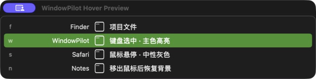
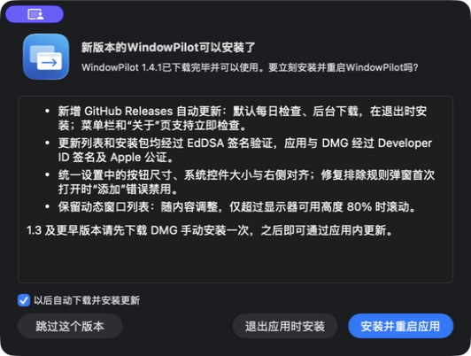

# Validation

## Application fallback for WeChat, 1.5.3

On September 9, 2026, the installed 1.5.2 switcher omitted the running WeChat 4.1.13 application despite having no exclusion rules and including hidden, minimized and windowless apps. Its AX window list contained only an untitled, nonmodal, nonclosable `AXDialog` matching WindowServer layer 8. The matching 240 × 50 helper had alpha zero. Filtering that panel was correct; checking the unfiltered AX list for emptiness incorrectly suppressed the regular application's fallback row.

The catalog now decides whether to add an application row after filtering, using the accepted-window count. The row uses the existing activation/reopen path and remains subject to windowless/hidden/application exclusion preferences. Accessory apps do not receive fallback rows, accepted windows do not gain duplicate application rows, and helper-panel acceptance rules are unchanged. Regression tests cover the observed WeChat facts, accessory/duplicate exclusions, and preference filtering.

All 55 tests passed locally with Thread Sanitizer (45 core/input/search/shortcut/preference cases and 10 isolated AppKit cases).

The Developer ID signed 1.5.3 (17) build was temporarily installed locally for UI verification. The same switcher now included WeChat; selecting its row made `com.tencent.xinWeChat` the actual foreground process and reopened the `Weixin` standard window with close/minimize controls. Accessibility remained authorized and keyboard switching ready. The original 1.5.2 bundle is preserved under the ignored `.build/updater-bootstrap/` directory for the production updater check.

Apple accepted the app (`e7cd9cb0-52cd-479a-b051-6701f9bf9a2d`) and DMG (`1d57dc70-72ed-4a17-8e5e-96cd4ad442e5`). The mounted DMG contains 1.5.3 (17), both CPU architectures, the exact built executable, a valid strict nested signature and offline ticket, and passes Gatekeeper. The feed metadata, EdDSA feed/archive signatures and all release checksums verify.

Release tag `v1.5.3` points to `10cd916`, which passed GitHub Actions run `34363191689`. The latest stable GitHub Release includes all four assets; their SHA-256 digests match the local files, and the public latest-feed URL returned the exact signed 1.5.3 feed.

For the production updater verification, the preserved 1.5.2 bundle was restored before publishing. Its actual “检查更新…” UI found 1.5.3 and displayed the release notes; “安装更新” downloaded the production payload, and “安装并重启应用” installed and relaunched 1.5.3 (17). The installed executable matches the published build, strict nested signatures and the stapled ticket validate, and Gatekeeper accepts it. The upgraded switcher includes WeChat. Settings show Accessibility authorized, keyboard switching ready, login startup and compact rows enabled, System appearance, and both automatic-update options enabled. The application is left running from `/Applications/WindowPilot.app` on 1.5.3.

## Native switcher glass, 1.5.2

The switcher now hosts its SwiftUI content in AppKit's `NSGlassEffectView` using the standard glass style. The 93%-opaque window-color fill, extra SwiftUI material and custom white border are removed. AppKit owns the glass backdrop and edge; the panel remains nonopaque with a clear window background. General settings offer System (default), Light and Dark appearances, persisted across launches and applied to the whole app through `NSApplication.appearance`. System sets the override to nil so native windows and SwiftUI continue following macOS. Neutral hover feedback uses the current foreground color so it remains visible in Aqua and Dark Aqua. The app already requires macOS 26, where this public glass API is available; no OS-version-specific border is drawn.

All 53 tests pass with Thread Sanitizer on macOS 26.6.2 / Xcode 26.6 (43 core/input/search/shortcut/preference tests and 10 isolated native-window cases). New coverage checks default and invalid appearance values, persistence of all three choices without changing row preferences, updates reaching existing native settings and glass content, and clearing application/window overrides when returning to System.

The preview shares the shipping surface and rows and uses a safe striped gradient behind a transparent borderless panel. Both appearances were inspected for readable labels, selected rows and intact layout. The isolated-window automation captures do **not** establish the live desktop transparency/blur appearance. macOS 27 and physical pointer behavior have not been tested.

Source commit `c58c665` passed GitHub Actions run `34043947024`. Apple accepted the app (`a140b537-e3e0-43d6-b316-dacd644d3e8c`) and DMG (`14198f3e-0cbb-4f90-b1f6-34002e15c5b9`); strict signatures, stapled tickets and Gatekeeper assessments pass. The mounted DMG contains 1.5.2 (16), both architectures and the exact built executable. Feed metadata and EdDSA signatures verify for the staged artifacts.

The notarized app was installed directly into `/Applications/WindowPilot.app` and relaunched; its executable hash matches the build. The prior notarized 1.5.1 app is retained under the ignored `.build/updater-bootstrap/` directory. Installed settings showed System by default, Accessibility authorized, keyboard switching ready, and login startup / compact rows still enabled. Selecting Dark, Light, then System visibly updated settings immediately; System was left selected and its saved value verified. Opening the installed switcher and cancelling with Escape worked. This initial installation was a local bundle upgrade, **not** a production Sparkle update test; the production verification below was completed after publishing.

On September 7, 2026, `v1.5.2` was published as the latest stable GitHub Release with all four verified assets (DMG, ZIP, signed appcast and checksums). Release tag `v1.5.2` points to `b1d6b4a`, which passed CI run `34044204155`. The public latest-feed URL returned the exact signed 1.5.2 feed, and GitHub's asset digests matched the local notarized artifacts.

For a production update test, the preserved notarized 1.5.1 build was temporarily restored to `/Applications/WindowPilot.app`. Its actual “检查更新…” UI found 1.5.2 and displayed the release notes. “安装更新” downloaded the payload, and “安装并重启应用” installed and relaunched 1.5.2 (16) through Sparkle. The installed executable SHA-256 matches the release; strict nested signatures, stapled ticket and Gatekeeper checks pass. Accessibility, keyboard readiness, login startup, compact rows, System appearance and both automatic-update options remain enabled. A second update check reports that 1.5.2 is current. The application is left running on 1.5.2.

Version 1.5.1: 51 tests passed locally with Thread Sanitizer (42 core/input/search/shortcut tests and 9 native-window cases). `scripts/test.sh` isolates each AppKit lifecycle case in a fresh process and requires a complete test summary; an early exit without test completion fails the run.

## Directory cleanup and pointer feedback, 1.5.1

Source files are now grouped by responsibility and the mixed `Models.swift` has been separated into window models/ordering and settings preferences/rules. Panel, row rendering and search highlighting have dedicated files. Build/test entry points remain stable; release, DMG, asset-generation and test-fixture helpers have dedicated directories. The old Xcode notarization flow is replaced by one Keychain-backed notarytool entry point for app and DMG. Feed generation cleans its temporary directory and writes one checksum manifest after signing all assets; rebuilding removes the previous generated bundle before copying the new one.

All 51 tests pass with Thread Sanitizer after the moves. Shell entry points pass syntax validation. The independent row preview uses the shipping `SwitcherRow` with sample titles and was inspected in Aqua and Dark Aqua: row spacing, selected color and labels remain intact. The switcher itself retains its dark appearance in both modes.

Hover is row-local, uses 10% neutral white over the dark background, resets on disappearance and never changes keyboard selection. Selected rows keep the system selection color. The panel explicitly accepts mouse movement. The native automation host delivered synthetic mouseMoved events but did not produce SwiftUI tracking callbacks, so this is **not** evidence of physical pointer enter/exit behavior; that interaction remains a manual verification item.

Release source commit `44b0b34` passed GitHub Actions run `34037111830`. Apple accepted the application (`0424f439-4e66-4a61-8da2-cf2ea0768e37`) and final DMG (`4c4d86bd-f6ac-4192-8de0-c872922a3043`). Both offline tickets and Gatekeeper assessments pass. The mounted DMG contains version 1.5.1 (15), both CPU architectures and the exact built executable. The signed feed and payload pass EdDSA verification and all three release checksums match.

After publishing `v1.5.1`, the installed 1.5.0 app found the update through the production feed, downloaded it and installed/relaunched using Sparkle. `/Applications/WindowPilot.app` now reports 1.5.1 (15); its executable matches the release, nested signatures and its stapled ticket validate, and Gatekeeper accepts it. The live settings show Accessibility authorized, window switching ready, login startup enabled, compact rows enabled and both automatic update options enabled. Opening and cancelling the installed switcher works. The prior notarized 1.5.0 app is retained in the ignored `.build/updater-bootstrap/` directory.

## Configurable shortcuts and native proportions, 1.5.0

Eight new cases verify preference migration and persistence, restoring defaults without resetting unrelated settings, rejecting invalid saved configurations and overlapping bindings, custom action modifiers and keyboard-layout characters, recording without triggering the switcher, explicit Save versus Escape cancellation, focus-loss cancellation, modifier-release confirmation after switching from Command to Option, and search text taking priority over printable shortcuts.

A signed development build was exercised through its actual settings: recorded and saved Option-Tab; attempted Command-Q for search and saw the conflict with Quit plus disabled Save; cancelled with Escape; and restored defaults. No user windows were closed by this test. Settings proportions were compared with macOS System Settings: native mini switches, small buttons with 13-point labels, 20-point sidebar icons and compact sidebar rows. No scaled custom switch drawing is used.

The final mini switches were inspected on General, Windows and About alongside macOS System Settings; the rule editor's native fields and paired buttons were also checked and cancelled. Production Sparkle then updated `/Applications/WindowPilot.app` from 1.4.4 to 1.5.0. The installed executable matches the published build, nested signatures and the stapled ticket validate, and accessibility/login/compact settings remain enabled. Shortcut defaults were restored after testing. Release commit `880874b` passed CI run `34004617038`.

## Fuzzy search, 1.4.4

Eight new cases cover ordered subsequences (`ws` → `watchOptions`), case-invariant scores/order, exact/prefix/contiguous ranking, better alignments after an early weak match, multiword matches across visible fields, stable session-order ties, Unicode folding and original grapheme offsets, attributed-text preservation, cache invalidation after query/title changes, and long or impossible queries. The existing X-prefix and Q/W action-isolation tests also pass with fuzzy results.

An optimized local benchmark of 200 synthetic windows with mixed English/Chinese titles completed 20 uncached searches in 143 ms (about 7 ms per search). This measures matching only, not a display-frame or third-party-window timing guarantee; navigation uses cached results.

Live UI verification after the production Sparkle update from 1.4.3 to 1.4.4: a disposable `watchOptions` window appears for `ws`; the original `w` and `s` are highlighted on both selected and unselected rows. Replacing the query with `WS` preserves the same result order. The installed executable matches the released executable, its nested signature and stapled ticket validate, and Accessibility remains authorized. The fixture was closed after testing. Release commit `934fe79` passed GitHub Actions run `34003449899`.

## Explicit search mode, 1.4.3

Regression tests send paired key-down/key-up events through the real `KeyboardInterceptor.handle` entry point. They verify: ordinary letters do not start searching; X enters search without entering the prefix into the query; `xq` matches QQ while Command remains held; Q/W/X input works with and without Command; deleting the last character keeps search mode active and window actions disabled; Escape clears both query and mode; and navigation preserves search. The empty search header is driven by mode rather than non-empty query. Existing selected-window action tests continue to cover normal-mode Cmd-W and modifier matching for Cmd-Q.

These are programmatic native event tests, not a physical keyboard or live UI automation test.

## Own settings activation regression, 1.4.2

The 1.4.1 failure was reproduced by selecting WindowPilot's own settings from its nonactivating switcher. An independent read-only window-order monitor showed ChatGPT remained frontmost and settings stayed behind it. The previous tests checked visibility, which did not establish foreground activation.

With 1.4.2, the same selection from Finder switched the actual foreground process to WindowPilot and placed settings before Finder in the normal window layer. Explicit ordering is followed by a Launch Services activation request when cooperative activation has not taken effect. Pending reopen requests are coalesced; cancelled callbacks cannot raise stale selections. No floating or always-on-top level is used.

New native tests cover unconditional ordering, reopen coalescing, cancellation and minimizing/restoring the settings window through the same activation path. The minimize regression verifies `isMiniaturized` before selecting and both restored visibility and normal level afterward. UI automation can itself send reopen events while inspecting minimized windows, so the minimization assertion uses direct in-process AppKit state rather than treating an inspection-triggered reopen as a successful switch.

## GitHub automatic update, 2026-09-05

Verified with the production GitHub Releases feed and Developer ID signed, notarized apps. An internal updater-enabled 1.4.0 (build 9) was installed once to bootstrap the test. Its update-check timestamp was cleared to trigger the normal scheduled check on the next launch; the 24-hour interval itself was not waited out.

- At 15:40 local time, 1.4.0 automatically fetched the signed feed and downloaded the 1.4.1 DMG in the background. Sparkle logged valid EdDSA signatures for both feed and update.
- Opening “检查更新…” showed **1.4.1 already downloaded and ready to install**. Choosing the native “安装并重启应用” button replaced the app in `/Applications` and relaunched it. No manual copy of 1.4.1 was used.
- The application changed from 1.4.0 (9), PID 13245, to 1.4.1 (10), PID 13463. Its executable hash matched the published build; strict nested code-signature verification, stapled ticket validation and Gatekeeper assessment passed.
- Accessibility remained authorized, the switcher reported ready, and login, compact rows, automatic checks and automatic downloads remained enabled.
- A subsequent update check reported “WindowPilot 1.4.1是当前的最新版本。”
- All four settings pages and the rule sheet were inspected. Text action buttons use equal label widths and native regular controls; add/remove icon buttons and sheet action pairs match. First opening the rule sheet now enables Add for its selected app, invalid regex disables it, and clearing the regex restores it. Test inputs were cancelled without saving a rule.

The release feed and DMG were independently verified using CryptoKit and the embedded public key. Disposable tampering tests rejected a modified feed and modified payload. Signed production artifacts and the exact feed are hosted together in release `v1.4.1`; release code passed GitHub Actions run `33952887996`.

The dynamic-height update was checked with 35 disposable fixture windows (`--window-count 35`). On a display with a 1410-point usable height, the overflowing panel stopped at 1128 points (80%). Filtering to 35 rows expanded to 1024 points without a scrollbar; narrowing to 9 results used 296 points, closing a selected fixture window shrank it to 268 points, and an empty search used 88 points. Deleting the unmatched query restored the list. The fixture was then quit through the selected-app action.

Automated tests cover ordering and Unicode search, window-role filtering, independent settings panels, process timeout backoff, incremental/full refresh merging, preference persistence, and selected-window close/quit handling.

The local-window regression suite repeatedly restores native windows and checks that background AX operations reject the application's own PID. The latency regression deliberately blocks the scanner and verifies that interactive actions can complete independently. Tests do not require Accessibility permission or manipulate user documents.

Manual development checks use the isolated `scripts/testing/WindowFixture.swift` application: a document NSWindow, an independent settings NSPanel, a title-change button and optional save/cancel dialogs. Previous checks verified minimized-window restoration, independent settings visibility, title refresh, targeted close/quit and cancel handling.

A development-machine sample measured full scans around 54 ms and single-app incremental scans around 9 ms after removing repeated timeouts against windowless helpers. These are workload-specific API timings, not a performance guarantee or display-frame measurement. Native minimization animations still apply.

Physical-keyboard hold/release behavior, third-party apps, multiple displays, Spaces/fullscreen, secure input, sleep/wake and login startup need ongoing real-world coverage. Targeted UI automation is not equivalent to physical global keyboard testing. CI checks compilation, tests with Thread Sanitizer, both binary architectures, bundle signatures and DMG integrity; its artifacts are ad-hoc signed development builds.
